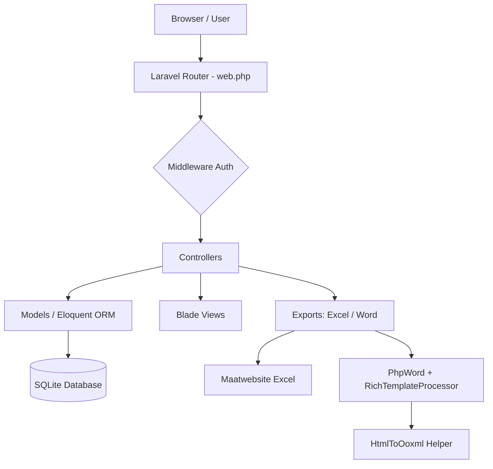
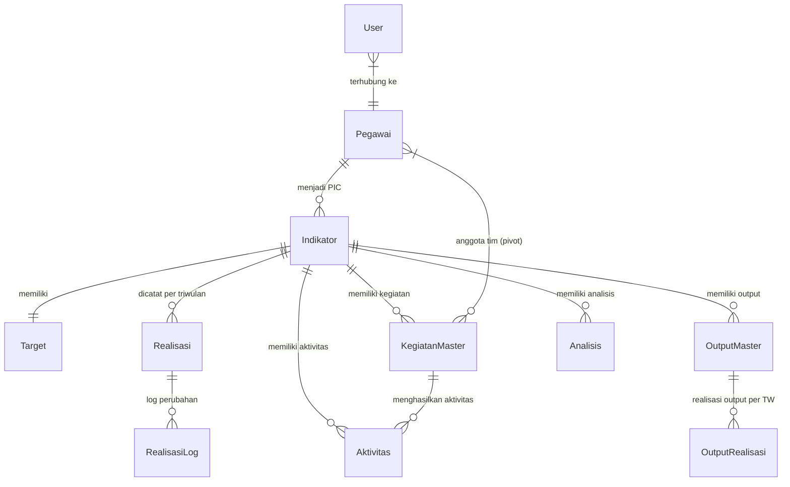

# Analisis Menyeluruh: kinerja-app

> Tanggal Analisis: 10 Juli 2026

---

## Ringkasan Eksekutif

**kinerja-app** adalah aplikasi web manajemen kinerja berbasis **Laravel 13** yang dirancang untuk instansi pemerintah (khususnya BPS/Badan Pusat Statistik). Aplikasi ini mengimplementasikan siklus **SAKIP** (Sistem Akuntabilitas Kinerja Instansi Pemerintah), mencakup pengelolaan indikator kinerja, pencatatan realisasi triwulanan, analisis kendala, dan pelaporan capaian kinerja.

---

## 1. Stack Teknologi

| Komponen | Teknologi | Versi |
|---|---|---|
| Backend Framework | Laravel | ^13.0 |
| PHP | PHP | ^8.3 |
| Frontend Bundler | Vite | — |
| CSS Framework | Tailwind CSS | — |
| Auth Scaffolding | Laravel Breeze | ^2.4 |
| Database | SQLite (dev) | — |
| Excel / Import | Maatwebsite Excel | ^3.1 |
| Word Generation | PhpOffice PhpWord | ^1.4 |
| Queue | Database Queue | — |
| Cache | Database Cache | — |

**Catatan:** Penggunaan SQLite sebagai database default menunjukkan ini masih fase **development/staging**. Untuk produksi perlu migrasi ke MySQL/PostgreSQL.

---

## 2. Arsitektur Aplikasi



### Struktur Layer
```
app/
├── Http/
│   ├── Controllers/       (14 controllers: 12 utama + 4 admin)
│   │   └── Admin/         (AktivitasCtrl, EvidenceCtrl, KegiatanMasterCtrl, OutputMasterCtrl)
│   └── Requests/          (5 Form Request: validasi terpisah)
├── Models/                (11 Eloquent models)
├── Services/              (RichTemplateProcessor - Word templating)
├── Helpers/               (HtmlToOoxml - 22KB - HTML → OOXML converter)
├── Exports/               (3 export: Capaian, Indikator, Realisasi)
├── Imports/               (4 import: Indikator, Kegiatan, Output, Pegawai)
└── View/Components/
```

---

## 3. Domain & Model Data

### Entity Relationship (Konseptual)



### Model Utama

| Model | Tabel | Fungsi |
|---|---|---|
| `Indikator` | `indikators` | Inti sistem — IKU/IKK dengan kode unik, sasaran, target tahunan |
| `Target` | `targets` | Target per triwulan (TW1–TW4) untuk setiap indikator |
| `Realisasi` | `realisasis` | Nilai realisasi kumulatif per triwulan |
| `RealisasiLog` | `realisasi_logs` | Audit trail perubahan nilai realisasi |
| `Analisis` | `analisis` | Narasi analisis, kendala, solusi, RTL per triwulan |
| `KegiatanMaster` | `kegiatan_masters` | Kegiatan dengan tahapan (JSON), ketua tim |
| `Aktivitas` | `aktivitas` | Catatan aktivitas oleh pegawai, dengan lampiran |
| `OutputMaster` | `output_masters` | Daftar output/deliverable per indikator |
| `OutputRealisasi` | `output_realisasis` | Progres output per triwulan |
| `Pegawai` | `pegawais` | Data pegawai (NIP, jabatan, seksi, no HP) |
| `User` | `users` | Akun login, terhubung ke pegawai |

---

## 4. Sistem Peran & Otorisasi

Aplikasi menerapkan sistem **2-role** yang sederhana:

```
┌─────────────────────────────────────────────────────────────┐
│  ADMIN                          PEGAWAI                      │
│  ─────                          ────────                     │
│  • Akses semua indikator        • Hanya indikator PIC-nya    │
│  • Tambah/hapus indikator       • Update indikator PIC-nya   │
│  • Kelola semua pegawai         • Input aktivitas & kendala  │
│  • Lihat semua output           • Lihat output terkait       │
│  • Akses riwayat realisasi      • Input realisasi (PIC)      │
│  • Export semua data            • Export data miliknya       │
│  • Generate notulen Word        • Akses ke notulen           │
└─────────────────────────────────────────────────────────────┘
```

Otorisasi diterapkan **inline di Controller** (bukan via Policy/Gate Laravel), misalnya:
```php
if (!auth()->user()->isAdmin() && $indikator->pic_id != $user->pegawai_id) {
    abort(403, 'Anda bukan PIC untuk indikator ini.');
}
```

---

## 5. Fitur Utama

### 5.1 Manajemen Indikator Kinerja
- CRUD indikator dengan kode unik (route key: `kode`)
- Import massal via Excel (template tersedia)
- Atribut computed: `capaian_tahunan`, `status_warna`, `output_progress`
- Tagging PIC (Person In Charge) dari daftar pegawai

### 5.2 Target & Realisasi
- Target tahunan + target per triwulan (TW1–TW4)
- Input realisasi kumulatif per triwulan
- **Validasi bisnis:** Nilai TW tidak boleh < nilai TW sebelumnya
- Audit log otomatis jika nilai berubah (`RealisasiLog`)
- Perhitungan capaian: `(realisasi / target) × 100%`

### 5.3 Manajemen Kegiatan & Output
- Kegiatan master dengan tahapan (disimpan sebagai JSON)
- Tim kegiatan: ketua + anggota (many-to-many via pivot `kegiatan_anggotas`)
- Output master dengan status achieved/not-achieved
- Upload file bukti output (PDF, Doc, Excel, gambar) max 50MB
- Realisasi output per triwulan (volume + progres %)

### 5.4 Analisis & Kendala
- Pegawai/ketua tim melaporkan kendala dengan severity (Low/Medium/High)
- RTL (Rencana Tindak Lanjut) hanya dapat diisi oleh ketua tim
- Upload file bukti kinerja dan tindak lanjut
- Narasi analisis kualitatif per triwulan

### 5.5 Laporan & Export
| Fitur | Format | Keterangan |
|---|---|---|
| Rekap Capaian Kinerja | `.xlsx` | Grouped by Tujuan → Sasaran |
| Export Indikator | `.xlsx` | Daftar lengkap indikator |
| Export Realisasi | `.xlsx` | Data realisasi per TW |
| Generate Notulen | `.docx` | Mengisi template Word dengan data kinerja |

### 5.6 Notulen Generator (Fitur Unggulan)
Fitur paling kompleks: mengambil data kinerja & mengisi template `.docx` secara dinamis menggunakan `PhpOffice\PhpWord\TemplateProcessor` yang telah di-extend (`RichTemplateProcessor`).

Mendukung:
- Placeholder teks biasa (`${variable}`)
- **HTML-to-OOXML conversion** untuk konten rich text (bold, italic, warna, list, dll.)
- **Tabel dinamis** dengan `cloneRowAndSetValues()`
- Konversi LaTeX ke OMML (matematika di Word)

---

## 6. Pemetaan Route

```
GET    /dashboard                  → DashboardController@index
GET    /indikator                  → IndikatorController@index
POST   /indikator                  → IndikatorController@store
GET    /indikator/{kode}           → IndikatorController@show (JSON)
PUT    /indikator/{kode}           → IndikatorController@update
DELETE /indikator/{kode}           → IndikatorController@destroy
POST   /indikator/import           → IndikatorController@import
POST   /indikator/{kode}/tautan    → IndikatorController@updateTautan

GET    /realisasi                  → RealisasiController@index
POST   /realisasi                  → RealisasiController@store
GET    /realisasi/entry/{kode}     → RealisasiController@entry
GET    /realisasi/history/{id}     → RealisasiController@history

GET    /rekap-capaian              → CapaianController@rekap
GET    /rekap-capaian/export       → CapaianController@export

GET    /kegiatan-master            → KegiatanMasterController@index
GET    /output-master              → OutputMasterController@index

GET    /notulen                    → NotulenController@index
POST   /notulen/download           → NotulenController@download

GET    /api/kegiatan/{indikator}   → PublicInputController@getKegiatan
POST   /aktivitas                  → PublicInputController@storeAktivitas
POST   /kendala                    → PublicInputController@storeKendala
```

---

## 7. Database: Migrasi & Evolusi Skema

Terdapat **33 file migrasi** (dibuat April 2026) yang menunjukkan iterasi pengembangan yang cepat:

```
Fase 1 (April 8):  Tabel dasar — indikators, targets, realisasis, 
                   analisis, pegawais, aktivitas
Fase 2 (April 8):  Tambah kode indikator, PIC, roles
Fase 3 (April 10): No HP pegawai, ketua tim, anggota kegiatan
Fase 4 (April 13): Output masters, unique kode, file path
Fase 5 (April 14): Output realisasis, field tambahan analisis/indikator
Fase 6 (April 15): Field tautan, penjelasan lainnya
Fase 7 (April 20): UX overhaul, tahapan analisis
Fase 8 (April 21): Nullable fields, update tipe values
Fase 9 (April 23): kegiatan_id di analisis
```

> [!WARNING]
> Banyak migrasi additive (tambah kolom, rename kolom) yang tidak dikonsolidasikan — menandakan **skema masih dalam fase fluks**. Kolom `tautan` di indikator juga sempat berganti nama (`penjelasan_tambahan` → `penjelasan_lainnya`).

---

## 8. Temuan & Potensi Perbaikan

### 🔴 Masalah Kritis

#### 1. Inkonsistensi Referensi PIC di `Analisis`
Model `Analisis` menggunakan `pegawai_nip` (string NIP) sebagai FK, **bukan `pegawai_id`** (integer). Ini menyebabkan query tambahan di setiap render:
```php
// Di RealisasiController@getContext — loop N+1
$aktivitas->map(function($a) {
    $pegawai = \App\Models\Pegawai::where('nip', $a->pegawai_nip)->first(); // N+1!
    ...
});
```

#### 2. N+1 Query Problem di Dashboard
```php
// DashboardController — status_warna mengakses lazy relation
$indikators->filter(fn($i) => $i->status_warna == 'success') 
// status_warna memicu getCapaianTahunanAttribute → query realisasis per item
```
Meski `with(['target', 'realisasis'])` sudah digunakan, akses via attribute accessor bisa memicu subquery tambahan.

#### 3. Password Default Hard-coded
```php
// PegawaiController@activateAccount
'password' => Hash::make('password'),
```
Password default `"password"` yang di-hardcode adalah **risiko keamanan** serius. Harus diubah menjadi password acak yang dikirimkan via email.

#### 4. Tidak Ada Middleware Role
Otorisasi sepenuhnya dilakukan **inline di controller** tanpa `Policy`, `Gate`, atau middleware role. Jika logika berubah, harus update di banyak tempat.

---

### 🟡 Potensi Perbaikan

#### 5. Duplikasi Logika Filter PIC
Logika "tampilkan data hanya untuk PIC/anggota/ketua tim" diulangi di:
- `DashboardController`
- `IndikatorController`
- `KegiatanMasterController`
- `OutputMasterController`

Sebaiknya diekstrak ke **Query Scope** di model atau **Policy** terpusat.

#### 6. Field `Analisis` Duplikat dengan `Indikator`
Model `Analisis` dan `Indikator` memiliki field yang hampir identik:
`kendala`, `solusi`, `rencana_tindak_lanjut`, `link_bukti_kinerja`, `file_bukti_kinerja`, dll.

Ini menunjukkan ada dua jalur input data yang saling tumpang tindih — berpotensi membingungkan pengguna dan developer.

#### 7. `Realisasi::realisasis()` Method Salah Nama
```php
// Model Realisasi — method salah nama, seharusnya logs()
public function realisasis() {
    return $this->hasMany(RealisasiLog::class); // Bukan Realisasi!
}
```
Ada dua method (`realisasis()` dan `logs()`) yang keduanya mengembalikan relasi `RealisasiLog`. `realisasis()` adalah **misleading name**.

#### 8. `Indikator::indikator()` Self-Reference Tidak Digunakan
```php
public function indikator() {
    return $this->belongsTo(Indikator::class); // Self-reference tanpa FK jelas
}
```
Tidak ada kolom `indikator_id` di tabel `indikators` — relasi ini mungkin adalah artifact yang belum dihapus.

#### 9. User Model: Duplikasi `$fillable`
```php
#[Fillable(['name', 'email', 'password'])]  // Attribute PHP 8
protected $fillable = ['name', 'email', 'password', 'role', 'pegawai_id']; // Array property
```
Ada dua definisi fillable yang **tidak sinkron** — attribute hanya mengandung 3 field, property array mengandung 5.

#### 10. Import Tanpa Validasi yang Kuat
Semua import (Indikator, Pegawai, Kegiatan, Output) tidak terlihat memiliki error handling yang robust — jika baris Excel tidak valid, seluruh import bisa gagal tanpa feedback yang jelas ke user.

---

### 🟢 Praktik Baik yang Sudah Diterapkan

| Aspek | Penilaian |
|---|---|
| Form Request terpisah | ✅ `IndikatorRequest`, `AnalisisRequest`, dll. |
| Eager loading | ✅ Konsisten menggunakan `with([...])` |
| Audit log realisasi | ✅ `RealisasiLog` mencatat perubahan nilai |
| Route Key custom | ✅ Indikator menggunakan `kode` bukan `id` di URL |
| File upload dengan cleanup | ✅ File lama dihapus saat update |
| JSON cast untuk array | ✅ `lampiran` dan `tahapan_json` di-cast ke array |
| KBBI title case mutator | ✅ `OutputMaster` memformat nama output otomatis |
| HTML-to-OOXML converter | ✅ Fitur canggih untuk notulen Word |

---

## 9. Skor Kualitas

| Dimensi | Skor | Keterangan |
|---|---|---|
| **Arsitektur** | 7/10 | Struktur MVC jelas, tapi otorisasi masih tersebar |
| **Keamanan** | 5/10 | Password hard-coded, tidak ada RBAC middleware |
| **Performa** | 6/10 | Ada potensi N+1, eager loading sudah ada tapi belum konsisten |
| **Maintainability** | 6/10 | Duplikasi logika di banyak controller |
| **Fitur Bisnis** | 9/10 | Sangat lengkap untuk kebutuhan SAKIP |
| **Dokumentasi** | 4/10 | README ada tapi minim, hampir tidak ada docblock |

---

## 10. Rekomendasi Prioritas

### Prioritas Tinggi
1. **Ganti password default** dengan password acak + kirim via email
2. **Perbaiki N+1 di `getContext`** — gunakan eager load atau single query dengan JOIN
3. **Bersihkan duplikasi method** di `Realisasi` model (`realisasis()` → hapus)
4. **Sinkronkan User `$fillable`** — hapus attribute PHP8 yang tidak lengkap

### Prioritas Menengah
5. **Ekstrak logika otorisasi PIC** ke Query Scope atau Policy
6. **Perjelas dualisme `Analisis` vs field di `Indikator`** — tentukan satu sumber kebenaran
7. **Tambah error handling di Import** (gunakan `WithValidation` dari Maatwebsite)
8. **Hapus `Indikator::indikator()` self-reference** yang tidak terpakai

### Prioritas Rendah
9. **Tambah database indeks** untuk kolom yang sering difilter (`pic_id`, `tahun`, `triwulan`)
10. **Siapkan konfigurasi production** — ganti SQLite dengan MySQL, set `APP_DEBUG=false`
11. **Tulis unit/feature tests** untuk logika bisnis kritis (validasi realisasi, perhitungan capaian)

---

## 11. Kesimpulan

`kinerja-app` adalah aplikasi yang **secara fungsional sangat solid** untuk kebutuhan manajemen kinerja instansi pemerintah. Fitur notulen generator dengan HTML-to-OOXML adalah pembeda yang cukup canggih. Namun, aplikasi ini masih berada di fase **early development** dengan beberapa technical debt yang perlu diatasi sebelum deployment produksi, terutama terkait keamanan (password default) dan skalabilitas (N+1 queries, database SQLite).
